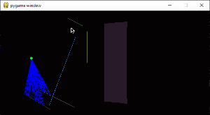

# Raycasting Pygame Demo
- Used pygame library to make a basic 3D library (Think Wolfenstein 3D but way shittier)
- Inspired by Coding Train's work
- Used multiple colored walls to simulate textures.
- Used mouse to affect field-of-view

